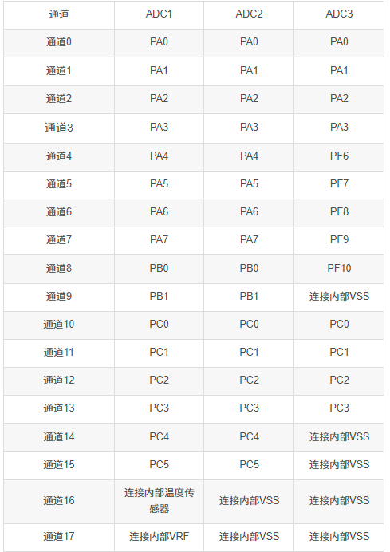

### 如何使用

引脚使用**PB1.**

*需要注意：烟雾传感器在上电之后不会立马有数据，需要等待**1-2**分钟左右*

1. 引入头文件

```c
#include "smog.h"
```

2. 在main函数中

```c
Smog_Init();
// 调用函数获取值
smog=Smog_Trans_Concentration();
printf("Smog_Rs_Val:%d\r\n", smog);

```


如果想用其他ADC通道，可以参考以下：


